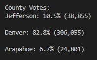
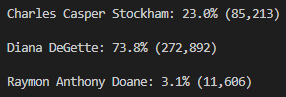

# election-analysis
---
## Overview

An audit is being conducted on recent election results. The election commission, has requested to review additional data to complete their audit. They would like to see the voter turnout for each county, the percentage of votes from each county (out of the total count), and the county with the highest turnout. In order to quickly turn out these results, the clients (Seth and Tom) have requested a review of the voting results they have collected along with the code they have written and add in code to efficiently pull out the commission's requested information.

Data provided by the client: [Election Results](Resources/election_results.csv)
Software: Python 3.7.6, Visual Study Code, 1.71.0

---

## Election-Audit Results

Text file with results of the analysis: [Election Results Analysis](Analysis/election_analysis.txt)

* How many votes were cast in this congressional election?

369711 votes were cast in this congressional election.

* Provide a breakdown of the number of votes and the percentage of total votes for each county in the precinct.

There are three counties involved in this congressional election: Jefferson, Denver, and Arapahoe. A breakdown of the voting pattern is shown below. For each county, we can see its percent of total votes along with its absolute number of votes.



* Which county had the largest number of votes?

From the above breakdown, it can be determined that Denver had the largest voter turnout out of the three counties with 306,055 voters.

* Provide a breakdown of the number of votes and the percentage of the total votes each candidate received.

In this congressional election, there were three candidates: Charles Casper Stockham, Diana DeGette, and Raymon Anthony Doane. The breakdown below shows each candidate's result for percent of total votes and their absolute number of votes.



* Which candidate won the election, what was their vote count, and what was their percentage of the total votes?

From the above breakdown, it can determined that Diana DeGette won the election with 272,892 votes or 73.8% of the total votes.

---

## Election-Audit Summary

An election commission performing an audit on the recent election results requested to view the voter turnout for each county, the percentage of votes from each county (out of the total count), and the county with the highest turnout. The clients, Seth and Tom, have provided the data collected from the election along with the code to determine the winning candidate (with their percentage of total votes and total number of votes). 

Using the data and the client's pre-written code, a new code was woven in to extract the commission's requested parameters. A new county list ```county_options``` and county dictionary ```county_votes``` were initiated to store the county names and their number of votes, respectively. In addition, new variables were declared to track the county with the largest turnout. A new for loop was added to iterate through the counties and count the number of votes for each county  The results are then printed to a text file for easy viewing. This is shown below:
```
    # 6a: Write a for loop to get the county from the county dictionary.
    for county_name in county_votes:

        # 6b: Retrieve the county vote count.
        cvotes = county_votes[county_name]

        # 6c: Calculate the percentage of votes for the county.
        county_vote_percent = float(cvotes) / float(total_votes) * 100

        # 6d: Print the county results to the terminal.
        county_results_summary = (f"{county_name}: {county_vote_percent:.1f}% ({cvotes:,})\n")
        print(county_results_summary)

        # 6e: Save the county votes to a text file.
        txt_file.write(county_results_summary)

        # 6f: Write an if statement to determine the winning county and get its vote count.
        if (cvotes > winning_county_count) and (county_vote_percent > winning_county_percent):
            winning_count_count = cvotes
            winning_county_percent = county_vote_percent
            largest_turnout = county_name

    # 7: Print the county with the largest turnout to the terminal.
    turnout_results = (
        f'\n-------------------------\n'
        f'Largest County Turnout: {largest_turnout}\n'
        f'---------------------------\n')
    print(turnout_results, end="")

    # 8: Save the county with the largest turnout to a text file.
    txt_file.write(turnout_results)
```
After adding in the above code, the following was determined:

- Jefferson county received 38,855 votes or 10.5% of total votes.
- Denver county received 306,055 votes or 82.8% of total votes.
- Arapahoe county received 24,801 votes or 6.7% of total votes.

It can then be concluded that Denver received the highest voter turnout.

